# Report

## Bathtub
### Run 1 PID
#### Parameters:
| Parameter | Value |
| --- | --- |
| h0 | 0.8 |
| A | 1 |
| C | 0.01 |
| epochs | 100 |
| target | 1.0 |
| time_steps | 50 |
| initial_control_signal | 0.0 |
| learning_rate | 0.05 |
| disturbance_strength | 0.001 |
| params | 0.1, 0.1, 0.1 |

MSE graph: 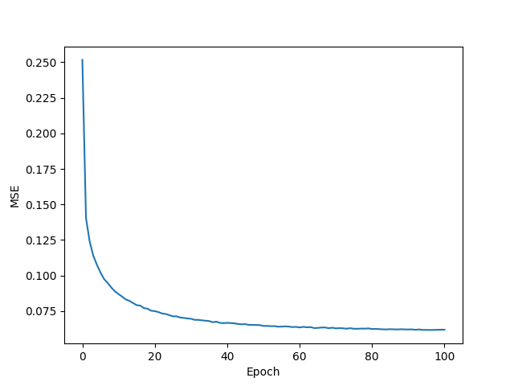
PID graph: 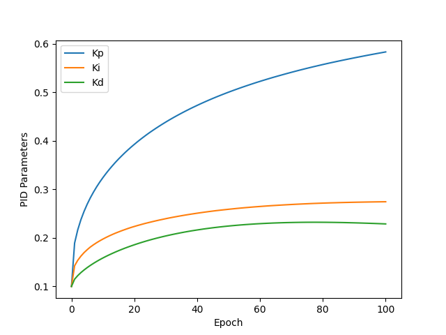

#### Summary:
The learning curve looks just like we want, smooth and steady. It does seem to flatten out after about 100 epochs. The PIDs also look like they are slowly converging to a value, but They don't reach a steady value with this number of epochs. 

### Run 2 NN
#### Parameters:
| Parameter | Value |
| --- | --- |
| h0 | 0.8 |
| A | 1 |
| C | 0.01 |
| epochs | 100 |
| target | 1.0 |
| time_steps | 50 |
| initial_control_signal | 0.0 |
| learning_rate | 0.05 |
| disturbance_strength | 0.001 |
| learning_rate | 0.001 |
| layers | [(3, 3), (3, 1)] |
| activation_functions | jax.nn.sigmoid, lambda x: x |
| nn_weight_range | (0.0, 0.01) |
| use_biases | True |
| use_adam_optimizer | True |

MSE graph: 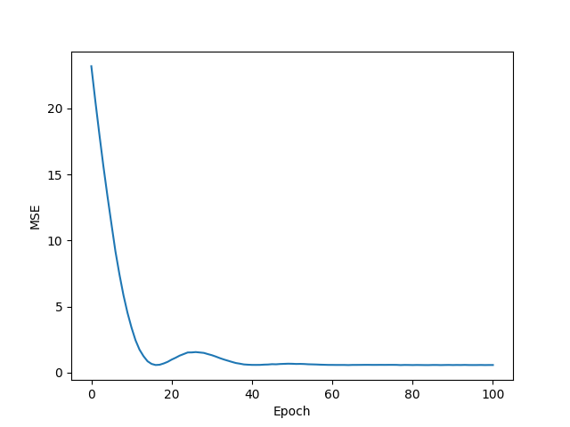

#### Summary:
Not so much to say, except that it learns to control the system quickly. However, interestingly, in this case, it learns much quicker without the adam optimizer.

## Cournot 
### Run 1 PID
#### Parameters:
| Parameter | Value |
| --- | --- |
| q1_0 | 0.5 |
| q2_0 | 0.5 |
| p_max | 2 |
| c_m | 0.5 |
| epochs | 100 |
| target | 0.2 |
| time_steps | 50 |
| initial_control_signal | 0.0 |
| learning_rate | 0.3 |
| disturbance_strength | 0.001 |
| params | 0.1, 0.1, 0.1 |

MSE graph: 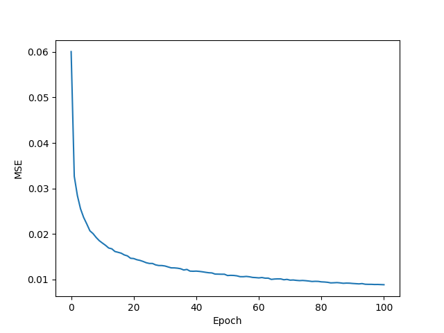
PID graph: 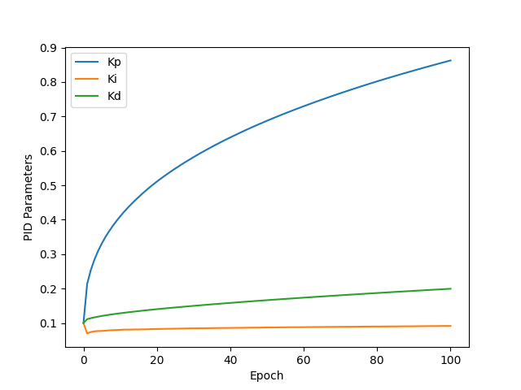

#### Summary:
Not much to say, smooth learning, the PID parameters haven't stabilized yet and we can see that they are likely to continue changing if we were to run more epochs. The same goes for the MSE, as it looks like it hasn't flattened out completely yet.

### Run 2 NN
#### Parameters:
| Parameter | Value |
| --- | --- |
| q1_0 | 0.5 |
| q2_0 | 0.5 |
| p_max | 2 |
| c_m | 0.5 |
| epochs | 100 |
| target | 0.2 |
| time_steps | 50 |
| initial_control_signal | 0.0 |
| learning_rate | 0.0003 |
| disturbance_strength | 0.001 |
| layers | [(3, 3), (3, 3), (3, 1)] |
| activation_functions | [jax.nn.sigmoid, jax.nn.sigmoid, lambda x: x] |
| nn_weight_range | (0.01, 0.02) |

MSE graph: 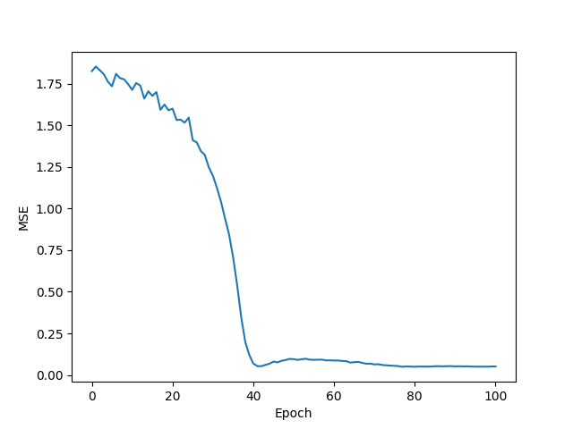

#### Summary:
A bit rougher to learn for the neural network, but it works fine with the Adam optimizer and eventually reaches low levels of MSE. Without the adam optimizer, I can't get the neural network to learn, and the MSE just bounces back up once it reaches a certain level.

## Inverted Pendulum
### Mathematical model of plant
### Summary

This mathematical model describes the dynamics of a cart-pendulum system. The model captures the complex interaction between the cart's linear motion and the pendulum's rotational dynamics, providing a basis for designing control algorithms to stabilize the system.

### Variables and Constants

- $\theta$: Angle of the pendulum rod with the vertical axis (upright position).
- $\dot{\theta}$: Angular velocity of the pendulum.
- $\ddot{\theta}$: Angular acceleration of the pendulum.
- $x$: Horizontal position of the cart.
- $\dot{x}$: Velocity of the cart.
- $\ddot{x}$: Acceleration of the cart.
- $m$: Mass of the pendulum.
- $M$: Mass of the cart.
- $l$: Length of the pendulum rod.
- $g$: Acceleration due to gravity (approximately $9.81 \, \text{m/s}^2$).
- $F_t$: Total external force applied to the system (control signal plus disturbance).

### Equations of Motion

The two following equations can be derived from the equations of total energy and using Lagranges equations (see [here](https://www.youtube.com/watch?v=Fo7kuUAHj3s) for a derivation):

1. 
$$ (M + m) \ddot{x} - m l \ddot{\theta} \cos(\theta) + m l \dot{\theta}^2 \sin(\theta) = F_t $$

2. 
$$ l \ddot{\theta} - \ddot{x} \cos(\theta) - g \sin(\theta) = 0 $$

### Solving for $\ddot{\theta}$ and $\ddot{x}$

Using these two equations, we can solve for the angular acceleration of the pendulum ($\ddot{\theta}$) and the acceleration of the cart ($\ddot{x}$):

$$ \ddot{\theta} = -\frac{F_t \cos(\theta) + g m \sin(\theta) + g M \sin(\theta) - l m \dot{\theta}^2 \cos(\theta) \sin(\theta)}{l (-m - M + m \cos(\theta)^2)} $$

$$ \ddot{x} = -\frac{\sec(\theta) (F_t \cos(\theta) - l m \dot{\theta}^2 \cos(\theta) \sin(\theta) + g m \cos(\theta)^2 \sin(\theta))}{-m - M + m \cos(\theta)^2} $$

We can calculate these parameters in the code for the current state based on the previous state values of $\theta$, $\dot{\theta}$, $x$, $\dot{x}$, and the control signal $F_t$.

### Discretization
We then use these values to calculate the next state values of $\theta$, $\dot{\theta}$, $x$, and $\dot{x}$ using the following equations:

$$ \theta_{t+1} = \theta_t + \dot{\theta}_t \Delta t $$

$$ \dot{\theta}_{t+1} = \dot{\theta}_t + \ddot{\theta}_t \Delta t $$

$$ x_{t+1} = x_t + \dot{x}_t \Delta t $$

$$ \dot{x}_{t+1} = \dot{x}_t + \ddot{x}_t \Delta t $$

### Run 1 PID
#### Parameters:
| Parameter | Value |
| --- | --- |
| theta_0 | 0.1 |
| theta_dot_0 | 0.0 |
| x_0 | 0.0 |
| x_dot_0 | 0.0 |
| length | 1.0 |
| mass_cart | 1.0 |
| mass_pendulum | 0.1 |
| delta_t | 0.01 |
| epochs | 100 |
| target | 0.0 |
| time_steps | 100 |
| initial_control_signal | 0.0 |
| learning_rate | 1 |
| disturbance_strength | 0.01 |
| params | 10.0, 0.0, 50.0 |
| use_adam_optimizer | True |

MSE graph: 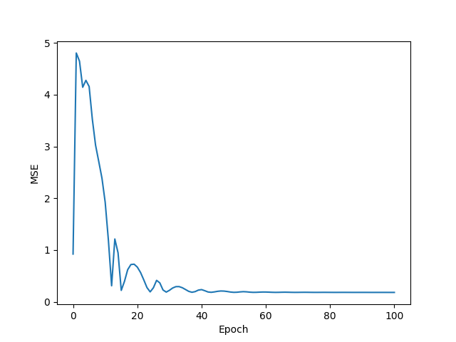
PID graph: 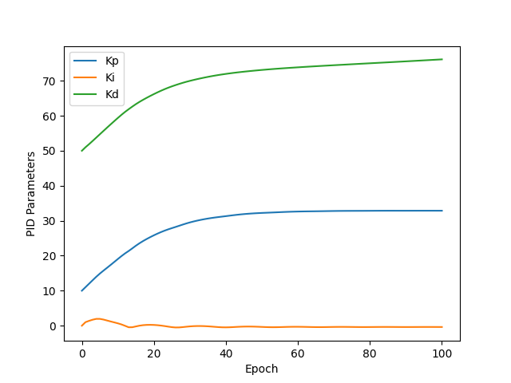

MSE graph without adam optimizer: 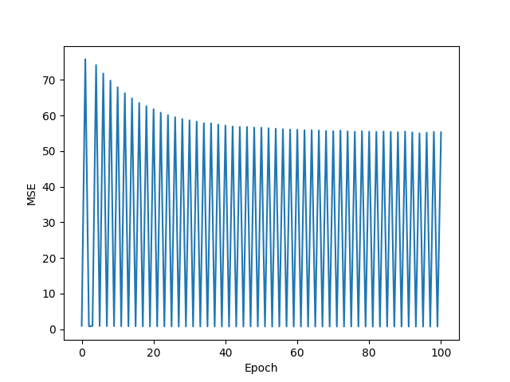
PID graph without adam optimizer: 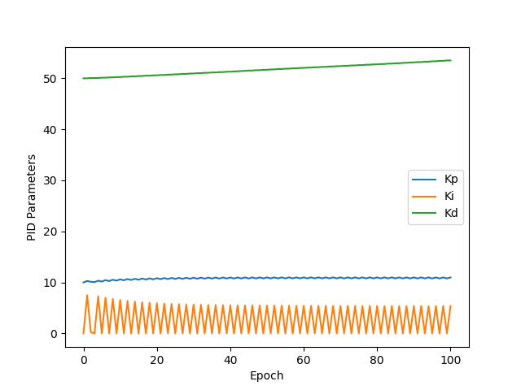

#### Summary:
The learning curve is quite weird. In the beginning it spikes up, possibly due to the very high learning rate, and we can see at this time that the integral parameter also goes up. When the integral parameter goes up, the system can become quite chaotic. But still, after a while, the PID is able to really well control the balancing of the pendulum. The adam optimizer is crucial for the learning in this run to stabilize, because when not using it, the MSE just oscillates up and down by huge amounts in tandem with the Ki oscillating between 0 and around 5. 

The initial PID values were chosen based on some manual tuning, by looking at the animation of how the pendulum moves and trying to find values that would make it not fall over, and to not oscillate too much. 

### Run 2 NN
#### Parameters:

| Parameter | Value |
| --- | --- |
| theta_0 | 0.1 |
| theta_dot_0 | 0.0 |
| x_0 | 0.0 |
| x_dot_0 | 0.0 |
| length | 1.0 |
| mass_cart | 1.0 |
| mass_pendulum | 0.1 |
| delta_t | 0.01 |
| epochs | 500 |
| target | 0.0 |
| time_steps | 100 |
| initial_control_signal | 0.0 |
| learning_rate | 0.02 |
| disturbance_strength | 0.1 |
| layers | [(3, 3), (3, 1)] |
| activation_functions | [jax.nn.sigmoid, lambda x: x] |
| nn_weight_range | (0.0, 25.0) |
| use_biases | True |
| use_adam_optimizer | True |
            

MSE graph: 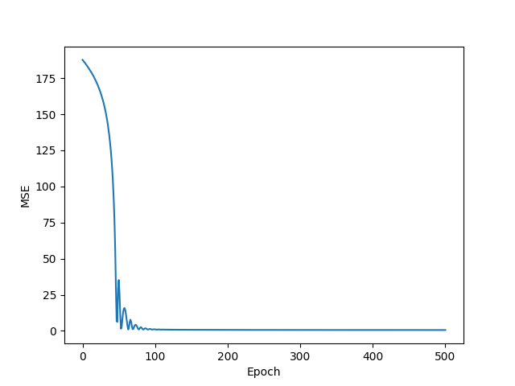

MSE graph without adam optimizer: 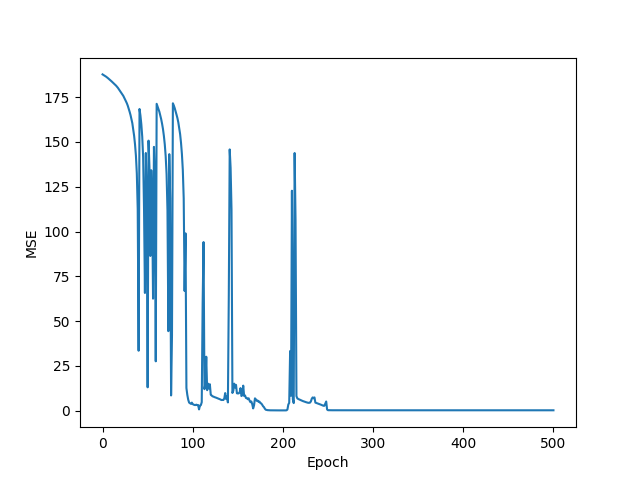

#### Summary:
Because of the quite high learning rate, the learning overshoots and we get this wiggly pattern before it stabilizes on a very low MSE level, successfully balancing the inverted pendulum for the duration of the simulation (100 time steps). The learning rate was chosen to be quite high to make the learning faster, but if i made it too high, the learning would not converge, and instead change between falling fast to the left, or fast to the right.

We can see from the learning curve without the adam optimizer that the optimizer has a huge effect on minimizing these oscillations and making the learning more stable. However the training without the optimizer also eventually converged and was able to balance the pendulum.

